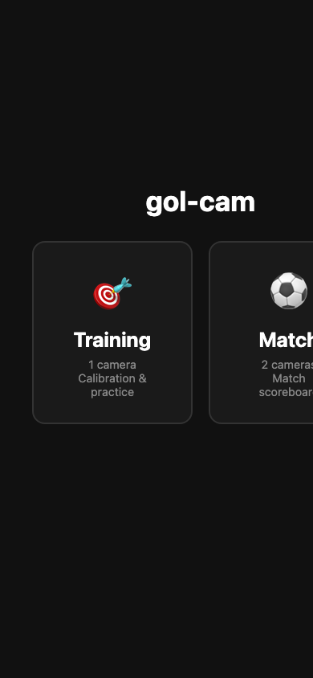
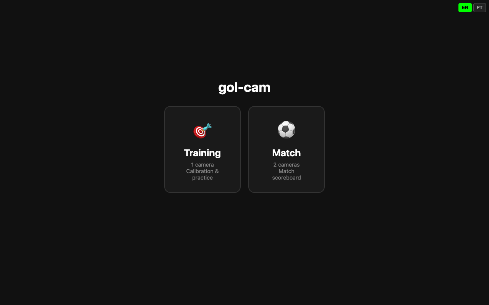
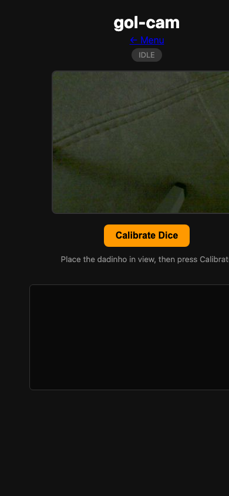
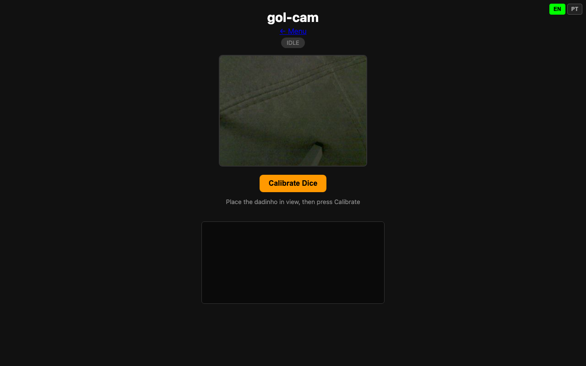
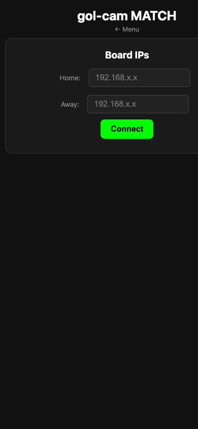
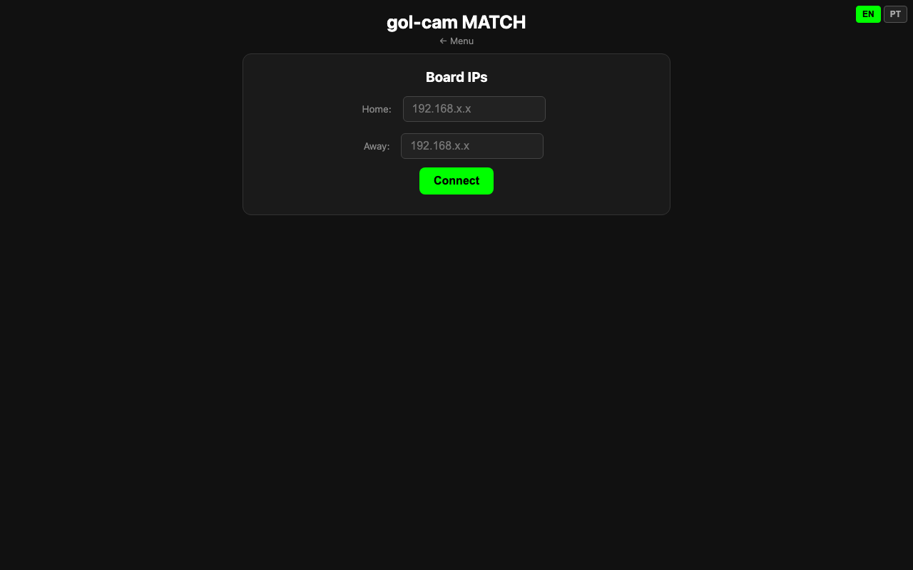

# gol-cam UX Audit & Creative Brief for Design Agency

**Date:** 2026-03-13
**Prepared by:** Engineering team
**Purpose:** Provide full UX context to external design agency for a UI/UX redesign

---

## 1. Product Overview

**gol-cam** is a mini camera-based goal detection system for button soccer ("futebol de botão"). A small ESP32-S3 camera module (42mm x 42mm) mounts on a tabletop soccer goal (15cm x 4cm) and uses computer vision to detect when a 4mm or 6mm ball enters the goal, triggering a scoring event with sound.

**Target users:** Button soccer enthusiasts, tabletop sports players, makers/hobbyists. Primarily Brazilian — the sport is most popular in Brazil.

**Hardware:** DFRobot ESP32-S3 AI Camera Module — runs a web server over WiFi. Users access the UI from any phone/tablet/laptop browser on the same network. There is no native app — the entire interface is served as HTML/CSS/JS from the ESP32.

**Key constraints:**
- The UI is served from a microcontroller with 16MB flash — pages must be lightweight
- All rendering is client-side (no server-side templating beyond serving static HTML)
- Users interact via phone browser while standing at a table — one-handed mobile use is critical
- Latency matters: the interface polls the board every 500ms for status updates
- Bilingual audience: English and Portuguese (recently added i18n)

---

## 2. Information Architecture

```
/ (Mode Select)
├── /training (Training Dashboard — single camera)
│   ├── States: IDLE → CALIBRATING → IDLE (calibrated) → PLAYING → PAUSED → IDLE
│   ├── Sub-features: VAR review, goal log, debug console
│   └── Back: ← Menu → /
└── /match (Match Dashboard — two cameras)
    ├── Phase 1: Config panel (enter 2 board IPs)
    ├── Phase 2: Live scoreboard + dual camera feeds
    ├── States: mirrors training but for 2 boards simultaneously
    ├── Sub-features: VAR review, goal log, unified controls
    └── Back: ← Menu → /
```

**Total pages:** 3
**Total user-visible strings:** ~73 (all translated EN/PT)

---

## 3. Current Screenshots

All screenshots captured from live hardware at both mobile (390x844) and desktop (1280x800) viewports.

### 3.1 Mode Select (`/`)

| Mobile | Desktop |
|--------|---------|
|  |  |

**Description:** Dark background (#111), centered layout. Title "gol-cam" in bold white. Two cards side-by-side: "Training" (target emoji, orange accent) and "Match" (soccer ball emoji, green accent). Cards have dark surface (#1a1a1a) with subtle border (#333), 16px border-radius. Hover lifts card and highlights border green. Language picker (EN/PT) fixed top-right.

**Issues observed:**
- On mobile (390px), the Match card is clipped off-screen — cards don't stack vertically
- No branding beyond plain text "gol-cam"
- Emoji icons are platform-dependent, inconsistent across devices
- Large empty space above and below content
- Language picker is tiny and may be hard to tap

### 3.2 Training Dashboard (`/training`)

| Mobile | Desktop |
|--------|---------|
|  |  |

**Description:** Shows IDLE state. Top: title "gol-cam" + "← Menu" link + state badge ("IDLE", gray pill). Center: live MJPEG camera feed (rounded corners, gray border). Below camera: orange "Calibrate Dice" button. Help text: "Place the dadinho in view, then press Calibrate". Bottom: dark debug console (monospace green text on near-black). Language picker top-right.

**Hidden states not captured (appear dynamically):**
- **CALIBRATING:** Badge turns orange "CALIBRATING...", button disabled, feedback text appears
- **Calibrated:** Calibration snapshot with orange border appears, "Start Game" button appears next to "Calibrate Dice"
- **PLAYING:** Badge turns green "PLAYING", score counter appears (5em bold), game control bar appears below camera (Pause / Reset / End Game), countdown bar with green fill, goal log entries accumulate
- **PAUSED:** Badge turns yellow "PAUSED", Resume button replaces Pause
- **GOOOL! flash:** Full-screen green overlay with "GOOOL!" text, fades after 2 seconds
- **Goal log entry:** Dark card with snapshot thumbnail (120px, green border), "GOL #N" in green, timestamp, red "VAR" button
- **VAR lightbox:** Full-screen dark overlay, enlarged snapshot, "Foi Gol" (green) and "Anula" (red) buttons
- **Annulled goal:** Entry fades to 40% opacity, "GOL #N" gets strikethrough in red

**Issues observed:**
- No visual hierarchy separating camera feed from controls from console
- Debug console always visible — not useful to casual players
- "Calibrate Dice" is jargon — users may not understand "dadinho"
- Score is just a giant number with no label
- "← Menu" link is styled as blue underlined text, inconsistent with button styling
- Camera feed takes up most of the screen but has no frame/label
- State badge is very small and easy to miss

### 3.3 Match Dashboard (`/match`)

| Mobile | Desktop |
|--------|---------|
|  |  |

**Description:** Shows config phase. Title "gol-cam MATCH" + "← Menu" link. Config panel: dark card (#1a1a1a) with "Board IPs" heading, two labeled inputs (Home/Away) with placeholder "192.168.x.x", green "Connect" button. Language picker top-right.

**Hidden states not captured (appear after connecting):**
- **Scoreboard:** "HOME" label, giant score "0 x 0" (4em), "AWAY" label
- **Dual camera feeds:** Side-by-side MJPEG streams, each with label ("Home Goal" / "Away Goal"), status badge (PLAYING/PAUSED/IDLE/OFFLINE), and "Calibrate Home"/"Calibrate Away" button
- **Match controls:** Start Match / Pause / Resume / Reset / End Match buttons
- **Goal flash + log:** Same as training but with side attribution ("GOL #1 (HOME)")
- **VAR lightbox:** Same as training

**Issues observed:**
- Config panel requires typing raw IP addresses — hostile UX
- No visual feedback while connecting / polling
- "Board IPs" heading is technical jargon
- After connecting, the config panel vanishes with no transition
- Scoreboard labels (HOME/AWAY) are detached from the score numbers — unclear which is which
- Camera feeds may overflow on mobile when side-by-side
- No match timer or period tracking

---

## 4. User Flows

### 4.1 Flow: Solo Training Session

```
1. User powers on board, connects phone to same WiFi
2. Opens board IP in browser → Mode Select page
3. Taps "Training" card → Training Dashboard (IDLE)
4. Sees live camera feed, positions dadinho (game piece) in view
5. Taps "Calibrate Dice" → badge shows CALIBRATING
6. System analyzes frame, shows calibration snapshot + feedback
7. If successful → badge returns to IDLE, "Start Game" button appears
8. Taps "Start Game" → badge shows PLAYING, score counter appears
9. Plays game — when ball enters goal:
   a. Screen flashes green "GOOOL!"
   b. Score increments
   c. Goal snapshot appears in log with VAR button
10. If disputed goal → taps VAR → lightbox opens → "Anula" to deduct
11. Taps "End Game" → returns to IDLE
```

**Pain points:**
- Step 2 requires knowing the board's IP address
- Step 4-6: calibration concept may confuse first-time users
- Step 9: 10-second cooldown after each goal (detection suppressed) — not communicated clearly
- No onboarding or tutorial

### 4.2 Flow: Two-Player Match

```
1. Two boards powered on, both on same WiFi
2. User opens either board's IP → Mode Select
3. Taps "Match" → Match Dashboard (config)
4. Enters both board IPs (or auto-detected if configured)
5. Taps "Connect" → config panel disappears
6. Sees scoreboard, two camera feeds, controls
7. Calibrates each board via its "Calibrate" button
8. Taps "Start Match" → both boards enter PLAYING
9. Goals detected on either side update unified scoreboard
10. VAR review available per goal
11. Taps "End Match" → both boards stop
```

**Pain points:**
- Step 4: manual IP entry is the biggest friction point
- Step 6: no visual confirmation that connection succeeded
- Step 7: must calibrate each board separately — no "calibrate both" shortcut
- No team name customization
- No match history or final score summary

### 4.3 Flow: Language Switching

```
1. User taps EN or PT button (top-right on any page)
2. All visible text switches immediately
3. Choice persists in localStorage across pages and sessions
4. Auto-detects browser language on first visit
```

---

## 5. Design System Inventory (Current State)

### 5.1 Color Palette

| Token | Hex | Usage |
|-------|-----|-------|
| Background | `#111` | Page background |
| Surface | `#1a1a1a` | Cards, panels, game bar, goal entries |
| Border | `#333` | Card borders, input borders, camera borders |
| Border hover | `#0f0` | Card hover state |
| Text primary | `#fff` | Headings, body text |
| Text secondary | `#888` | Labels, descriptions, timestamps |
| Accent green | `#0f0` / `#0a0` | Goal flash, score, "Start" buttons, online status |
| Accent orange | `#f90` | Calibration, training icon accent |
| Accent red | `#c00` | End/stop buttons, VAR, offline status, annulled |
| Accent yellow | `#ff0` | Pause button, paused state |
| Input bg | `#222` | Text input backgrounds |
| Disabled | `#333` / `#666` | Disabled buttons |

### 5.2 Typography

- **Font:** `system-ui, sans-serif` (no custom font)
- **Title:** 2.2em (mode select), 1.8em (training), 1.6em (match)
- **Score:** 5em (training), 4em (match)
- **Buttons:** 1em, bold
- **Body:** 0.85em
- **Console:** monospace, 0.7em

### 5.3 Component Inventory

| Component | Variants | Notes |
|-----------|----------|-------|
| Button | `.btn-cal` (orange), `.btn-start` (green), `.btn-pause` (yellow), `.btn-resume` (green), `.btn-reset` (gray), `.btn-end` (red), `.btn-go` (bright green), `.btn-var` (red small), `.btn-foi` (green large), `.btn-anula` (red large) | 10 button variants, no consistent sizing |
| Card | Mode select card | Only used on mode select page |
| Badge/Pill | State badge (idle/cal/play/pause), feed status (online/offline/idle) | Different sizes on different pages |
| Input | Text input | Only on match config |
| Camera feed | `` with border | No loading state |
| Goal entry | Thumbnail + info + VAR button | Horizontal card layout |
| Lightbox | Full-screen overlay with image | Used for VAR review |
| Flash overlay | Full-screen green + "GOOOL!" text | 2-second animation |
| Debug console | Scrolling monospace log | Always visible in training |
| Countdown bar | Thin green progress bar + text | 10s post-goal cooldown |
| Language picker | Two small buttons (EN/PT) | Fixed top-right |

### 5.4 Spacing & Layout

- All pages use flexbox, column direction, centered
- Max-width: 400px (training), 600px (match controls/config/log), 800px (match feeds)
- Padding: 15px (training), 10px (match), 20px (mode select)
- Border-radius: 16px (cards), 12px (panels, badges), 8px (buttons, camera, entries), 6px (inputs, console, small buttons)
- Gap: 20px (cards), 10px (feeds), 8px (controls)

---

## 6. Technical Constraints for Redesign

1. **HTML/CSS/JS only** — no React, no build tools. The entire page must be a single self-contained HTML blob (stored as a C string literal in firmware). No external CDN, no image assets, no web fonts.
2. **Total budget per page: ~15KB** — currently ~3-5KB each. Must stay well under 16MB flash total.
3. **No images/SVGs in source** — only emoji and CSS-drawn elements. Any icons must be inline SVG or CSS.
4. **Client-side rendering** — all dynamic content is constructed via DOM manipulation in vanilla JS.
5. **Real-time polling** — the UI fetches `/status` JSON every 500ms. Design must accommodate frequent state changes without jarring layout shifts.
6. **MJPEG stream** — camera feed is a continuously-updating `` tag, not a `<video>`. Cannot be styled with video controls.
7. **Mobile-first** — primary use is phone in one hand at a table. Touch targets must be large.
8. **Dark theme only** — the device is used in varied lighting; dark theme reduces glare and phone brightness interference with the camera.
9. **Bilingual** — all text must use `data-i18n` attributes or `t()` function calls. No hardcoded strings.
10. **Offline-capable** — the board serves pages directly, no internet required. Cannot load external resources.

---

## 7. Creative Brief

### 7.1 Project

Redesign the gol-cam web interface — 3 pages served from an ESP32 microcontroller, accessed via phone browser on local WiFi.

### 7.2 Objective

Transform a functional-but-developer-built interface into a polished, sports-themed experience that feels like a real product. The current UI works well technically but looks like a prototype. The redesign should make goal celebrations feel exciting, game state feel clear, and the overall experience feel premium despite running on a $19 microcontroller.

### 7.3 Audience

- **Primary:** Brazilian button soccer players, ages 10-50, playing at home or in clubs
- **Secondary:** Makers/hobbyists who build hardware projects
- **Context:** Standing at a table, phone in hand or on a stand nearby, glancing at the screen between plays
- **Tech literacy:** Moderate — can connect to WiFi but should not need to type IP addresses or understand "calibration"

### 7.4 Tone & Personality

- **Sporty and energetic** — this is a game! Celebrations should feel rewarding
- **Simple and confident** — minimal text, large touch targets, clear state
- **Brazilian football culture** — green/yellow accents welcome, "GOOOL!" is culturally significant
- **Not childish** — clean and modern, not cartoon-ish

### 7.5 Key Design Challenges

1. **Goal celebration moment** — the current green flash is underwhelming. This is THE key moment of the product. It should feel like scoring a real goal — stadium-worthy celebration on a phone screen.

2. **State clarity** — users must immediately see: Am I calibrated? Am I playing? Did a goal just happen? Is the camera connected? Current state badges are tiny and easy to miss.

3. **Onboarding / first-time experience** — there's no setup wizard. A first-time user sees a camera feed and a "Calibrate Dice" button with no context. The flow should be self-explanatory.

4. **IP address entry** (match mode) — entering raw IPs is the worst part of the UX. While we can't change the networking model, the UI should make this as painless as possible (e.g., remember last used, auto-fill, clear instructions).

5. **Debug console** — currently always visible in training. Should probably be hidden by default with a toggle for advanced users.

6. **VAR review** — the video-review concept (borrowed from real football) is fun and should feel dramatic, not like a simple modal.

7. **Responsive layout** — mode select cards clip on mobile. Match feeds need to stack on narrow screens. All pages need to work from 320px to 1280px.

### 7.6 Deliverables Requested

- **UI mockups** for all 3 pages, all states (idle, calibrating, playing, paused, goal flash, VAR review)
- **Mobile-first** designs at 390px width, with desktop adaptations
- **Component library** — buttons, badges, cards, inputs styled consistently
- **Goal celebration animation** concept (CSS-only, no JS libraries)
- **Color palette and typography** recommendations (system fonts only, no web fonts)
- **Icon set** — inline SVG replacements for emoji (consistent cross-platform)
- **i18n-compatible** — all text in mockups should use placeholder keys, not hardcoded strings

### 7.7 Out of Scope

- Native app design (this is a browser-based interface only)
- Backend/API changes (endpoints are fixed)
- Hardware modifications
- Logo/brand identity (just the web UI)

---

## 8. Appendix: All UI States Reference

### Training Dashboard States

| State | Badge | Score | Camera | Controls | Other |
|-------|-------|-------|--------|----------|-------|
| IDLE (uncalibrated) | "IDLE" gray | hidden | streaming | "Calibrate Dice" | hint text |
| CALIBRATING | "CALIBRATING..." orange | hidden | streaming | button disabled | "Analyzing frame..." |
| IDLE (calibrated) | "IDLE" gray | hidden | streaming | "Calibrate Dice" + "Start Game" | cal snapshot + feedback |
| PLAYING | "PLAYING" green | visible, large | streaming | Pause / Reset / End Game | countdown bar (first 10s) |
| PLAYING + goal | flash overlay | incremented | streaming | unchanged | new goal log entry |
| PAUSED | "PAUSED" yellow | visible | streaming | Resume / Reset / End Game | — |
| VAR review | — | — | — | lightbox: "Foi Gol" / "Anula" | enlarged snapshot |
| Disconnected | — | — | — | — | "disconnected" text |

### Match Dashboard States

| State | Scoreboard | Feeds | Controls | Other |
|-------|-----------|-------|----------|-------|
| Config | hidden | hidden | "Connect" | IP input form |
| Connected (idle) | "0 x 0" | 2 streams, "IDLE" badges | "Calibrate Home/Away" | — |
| Connected (calibrated) | "0 x 0" | "READY" badges | + "Start Match" | — |
| Playing | updating | "PLAYING" badges | Pause / Reset / End Match | goal log entries |
| Goal scored | flash overlay | unchanged | unchanged | new entry in log |
| Board offline | unchanged | "OFFLINE" red badge | unchanged | — |
| VAR review | — | — | lightbox | enlarged snapshot |

---

## 9. File & Screenshot Index

```
.reports/
├── ux-audit-creative-brief.md    ← this file
└── screenshots/
    ├── 01-mode-select.png         (mobile 390x844)
    ├── 02-training-idle.png       (mobile 390x844)
    ├── 03-match-config.png        (mobile 390x844)
    ├── 04-mode-select-desktop.png (desktop 1280x800)
    ├── 05-training-desktop.png    (desktop 1280x800)
    └── 06-match-desktop.png       (desktop 1280x800)
```
